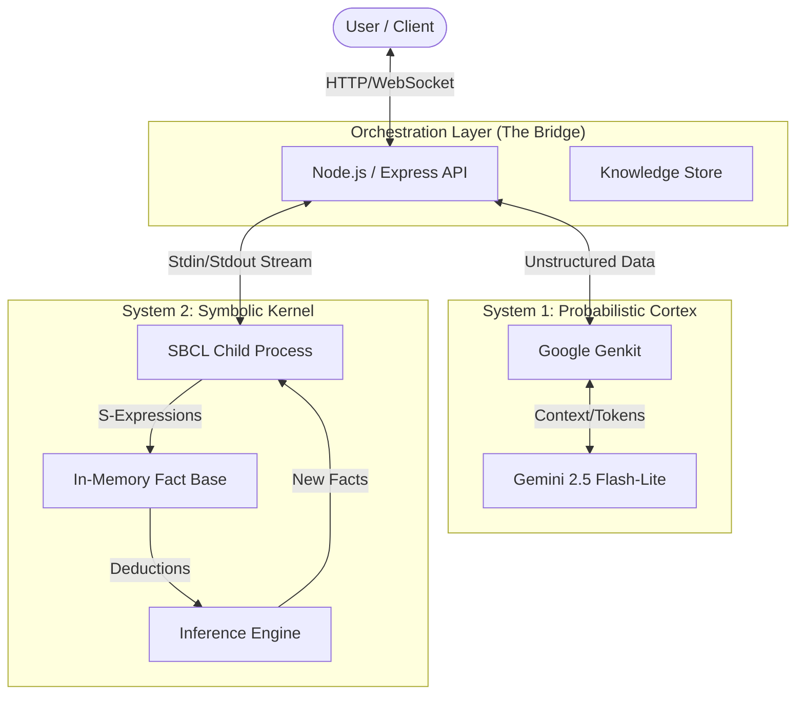

# SDialectic: A Dual-Process Neurosymbolic Architecture

**Version:** 0.1.0  
**Status:** Active Development not ready for Production  
**License:** Dual License (Free for Personal Non-Commercial Use; Commercial License Required)

---

## 1. Abstract

**SDialectic** represents a practical implementation of a **Dual-Process cognitive architecture**, designed to bridge the gap between the probabilistic flexibility of Large Language Models (System 1) and the rigorous deterministic consistency of Symbolic Logic (System 2).

By integrating **Google Gemini** (via Genkit) as the semantic perception layer and **Steel Bank Common Lisp (SBCL)** as the inferential kernel, the system achieves a state of "grounded intelligence". Unstructured data is not merely summarized but transmuted into structured knowledge graphs and executable logic rules, enabling auditable reasoning and persistent memory that survives the ephemeral context window of standard LLMs.

---

## 2. System Architecture

The architecture follows a strict separation of concerns, orchestrated by a Node.js middleware that acts as the *Corpus Callosum*, facilitating communication between the Neural and Symbolic hemispheres.



### Key Components

*   **The Neural Interface (System 1):** Utilizes Gemini 2.5's multimodal capabilities to perceive messy, real-world data (PDFs, Images, Text) and extract structured propositions and causal laws.
*   **The Symbolic Kernel (System 2):** A persistent SBCL process that maintains the *True State* of the world. It rejects contradictions, applies forward-chaining inference, and provides a queryable axiomatic base.
*   **The Graph Engine:** A synchronization layer that maps the rigorous Lisp memory states into visualizable directed acyclic graphs (DAGs) for human interpretation.

---

## 3. The Knowledge Extraction Pipeline

The core innovation of SDialectic is its "Knowledge Transmutation" pipeline, which converts raw information into executable wisdom.

```mermaid
sequenceDiagram
    participant Doc as Raw Document
    participant LLM as System 1 (Gemini)
    participant Parser as S-Expression Parser
    participant Kernel as System 2 (SBCL)
    participant Graph as Knowledge Graph

    Doc->>LLM: Ingest Multimodal Content
    Note right of LLM: Semantic Analysis & Pattern Recognition
    LLM->>LLM: Generate Lisp Code (Facts + Rules)
    LLM->>Parser: Stream S-Expressions
    Parser->>Kernel: Batched Injection (progn ...)
    
    rect rgb(20, 20, 30)
        Note right of Kernel: Symbolic Validation & Inference
        Kernel->>Kernel: Check Consistency
        Kernel->>Kernel: Apply Forward-Chaining
    end
    
    Kernel->>Graph: Export Validated State
    Graph->>Graph: Update Visualization
```



### 3.1 Transmutation Steps

1.  **Semantic Parsing:** The LLM identifies concepts (`Entities`) and the relationships (`Predicates`) between them, adhering to a strict ontology (e.g., Causal, Methodological).
2.  **Rule Synthesis:** Beyond facts, the system extracts *rules* (e.g., "If X increases, Y decreases"). These are formatted as Lisp macros (`adicionar-regra`) capable of logical execution.
3.  **Atomic Injection:** Extracted knowledge is broken down into atomic units (triplets) and injected into the Lisp kernel.
4.  **Inference Propagation:** Once new facts enter the kernel, the inference engine automatically derives second-order consequences, expanding the knowledge graph without further LLM token usage.

---

## 4. The Reflective Loop (RAG + Reasoning)

SDialectic replaces the standard "Retrieve-Then-Generate" RAG pattern with a **Reflective Loop**. The system does not just retrieve text chunks; it retrieves *facts* and *logic* to construct an answer.

```mermaid
flowchart LR
    Query(User Query) --> Decomposition
    Decomposition[Semantic Decomposition] --> Search
    
    subgraph "Hybrid Retrieval"
        Search --> Vector[Vector Search (Embeddings)]
        Search --> Symbolic[Symbolic Query (Lisp)]
    end
    
    Vector --> Synthesis
    Symbolic --> Synthesis
    
    Synthesis[Reasoning Synthesis] -->|Context| LLM
    LLM --> Response(Final Answer)
    
    style Vector fill:#2a3,stroke:#333,stroke-width:2px
    style Symbolic fill:#3a6,stroke:#333,stroke-width:2px
```

*   **Vector Search:** Finds conceptually related text passages (for nuance and tone).
*   **Symbolic Query:** Queries the Lisp kernel for definitive relationships (e.g., `(get-rel "Inflammation" ?predicate ?object)`).
*   **Synthesis:** The LLM receives both the textual context and the "Ground Truth" logical table, significantly reducing hallucinations.

---

## 5. Technical Implementation Details

### 5.1 Backend Services
*   **`sbcl-process.ts`**: Handles the lifecycle of the Lisp child process. It implements a command queue with timeout protection and automatic crash recovery to ensure high availability.
*   **`graph-service.ts`**: Manages the ingestion flow. It now supports **non-blocking batched injection**, allowing thousands of relations to be processed in milliseconds during rehydration.

### 5.2 Persistence & Recovery
The state is persisted using a hybrid strategy:
*   **Hot Memory:** Active SBCL Heap.
*   **Cold Storage:** JSON snapshots (`data/graphs/*.json`) containing both the graph topology and the raw Lisp rules.
*   **Rehydration:** Upon restart, the `GraphEngine` reads the JSON snapshot and "re-teaches" the Lisp kernel by replaying the entire history of facts and rules in a single batch transaction.

### 5.3 Frontend Visualization
The interface is a direct window into the machine's mind:
*   **Interactive Graph:** Built with ReactFlow, it renders the dynamic topology of the knowledge base.
*   **Source Isolation:** Chat history and active knowledge contexts are strictly isolated per document source to prevent context leakage.
*   **SBCL Repl:** A raw console interface allowing power users to interact directly with the Lisp kernel (e.g., `(describe 'concept)`).

---

## 6. Getting Started

### Prerequisites
*   **Node.js** (v18+)
*   **pnpm** (Package Manager)
*   **SBCL** (Steel Bank Common Lisp) installed in `$PATH`
*   **Google Cloud Credentials** (ADC) for Genkit

### Installation

```bash
# Clone the repository
git clone https://github.com/spock74/s-dialectic.git

# Install dependencies (Root, Backend, and Frontend)
pnpm install

# Build the shared logic packages
pnpm build
```

### Running the System

```bash
# Start the Backend (API + Lisp Kernel)
cd backend
pnpm start

# Start the Frontend (Vite)
cd frontend
pnpm dev
```

---

**Developed by:** Spock74  
