# SDialectic: The Lisp Meta-Powered Cognitive Engine

> **"Logic and Intuition are not opposites, but the two wings of the same bird."**

**SDialectic** (Symbolic Dialectic) is a neuro-symbolic cognitive architecture that fuses the fluid semantic intuition of **Generation 3 LLMs** with the rigid structural logic of **Common Lisp**.

Unlike traditional "Stateless" AI interaction, SDialectic embeds a persistent **Lisp Runtime (SBCL)** directly into the cognitive loop. The LLM doesn't just "talk"; it *thinks* by interacting with a persistent symbolic world, creating a feedback loop of continuous self-refinement.

---

## 🏛️ System Concept: The Neuro-Symbolic Loop

The system operates on a dual-process theory (System 1 vs System 2):

1.  **System 1 (Neural/Intuition)**: `Gemma 3 1b` acts as the natural language interface, synthesizing information and communicating with the user.
2.  **System 2 (Symbolic/Logic)**: `Qwen 2.5 Coder 3b` acts as the Logic Engine, translating natural language into formal Lisp code and executing it within a persistent environment.

---

## 🛠️ Architecture & Code Artifacts

The system is split between a TypeScript/Node.js shell and a Common Lisp core.

### Key Components:
- **`sbcl-process.ts`**: Manages the life-cycle of the SBCL process, handles IPC communication via a sentinel-based protocol, and recovers from Lisp debuggers automatically.
- **`reflective-loop.ts`**: Orchestrates the multi-turn interaction between the Logic Model and the Lisp kernel.
- **`bootstrap.lisp`**: The "operating system" inside SBCL, defining concepts, relations, rules, and JSON serialization.

---

## 🔄 Sequence: User Messaging & Reflection

When a user sends a message, the system undergoes a **Reflective Loop** before replying.

```mermaid
sequenceDiagram
    participant U as User
    participant S1 as System 1 (Gemma)
    participant L as Logic Engine (Qwen)
    participant SK as Symbolic Kernel (SBCL)

    U->>S1: "Einstein and Gödel were friends in Princeton"
    S1->>L: "Extract and Structure this information"
    
    loop Reflection (Turn n)
        L->>SK: (adicionar-memoria "Einstein" "Físico")
        SK-->>L: "Memorizado: Einstein"
        L->>SK: (adicionar-relacao "Einstein" "amigo" "Gödel")
        SK-->>L: "Relacao estruturada: EINSTEIN -[AMIGO]-> GÖDEL"
    end
    
    Note over SK: (salvar-estado "knowledge.lisp")
    
    S1->>U: "Einstein e Gödel eram amigos em Princeton."
```

---

## 🔌 Lisp-Node.js API (Bridging Functions)

The communication is performed via S-Expressions. Below is the mapping of core functions:

| Function | Arguments | Description |
| :--- | :--- | :--- |
| `adicionar-memoria` | `(name description)` | Creates or updates a node in the Knowledge Graph. |
| `adicionar-relacao` | `(sub pred obj)` | Creates a directed edge between two concepts. |
| `adicionar-regra` | `(name conditions consequences)` | Defines a logical rule for the inference engine. |
| `inferir` | `()` | Runs forward-chaining inference on all relations. |
| `listar-dados-json` | `()` | Serializes the entire graph for the ReactFlow frontend. |
| `salvar-estado` | `(filename)` | Persists the internal state to a Lisp file. |

---

## 🚀 Current State (Status 2.0)

- **Models**: Currently utilizing `gemma3:1b` (Chat) and `qwen2.5-coder:3b` (Logic) via Ollama.
- **Enriched Reasoning**: The chat model now receives the **full stdout trace** from the Lisp execution, ensuring it "sees" the same reality as the kernel.
- **Stability**: Singleton SBCL enforcement and debugger-recovery logic allow for 24/7 uptime.
- **Deep Extraction**: The logic model is tuned to atomize complex sentences into granular locations, topics, and actions.

---

## 📦 Installation & Usage

1. **Install Prerequisites**: SBCL, Node.js 20+, and Ollama.
2. **Setup**: `pnpm install` in both `backend` and `frontend`.
3. **Environment**: Configure `.env.local` in `backend` with your model names.
4. **Run**: `pnpm dev:pm2` for a supervised backend experience.

---

*Copyright © 2025 SDialectic Labs. Proprietary / Stealth Beta.*
