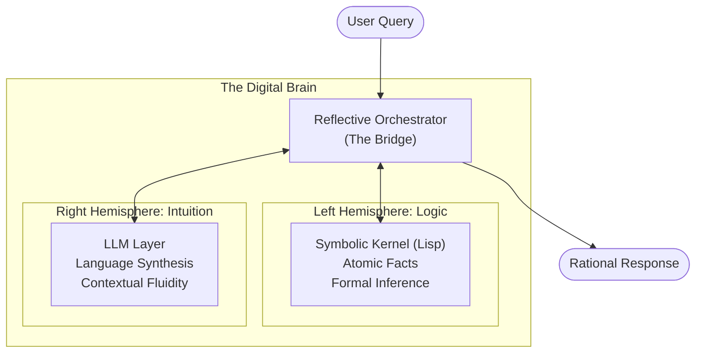
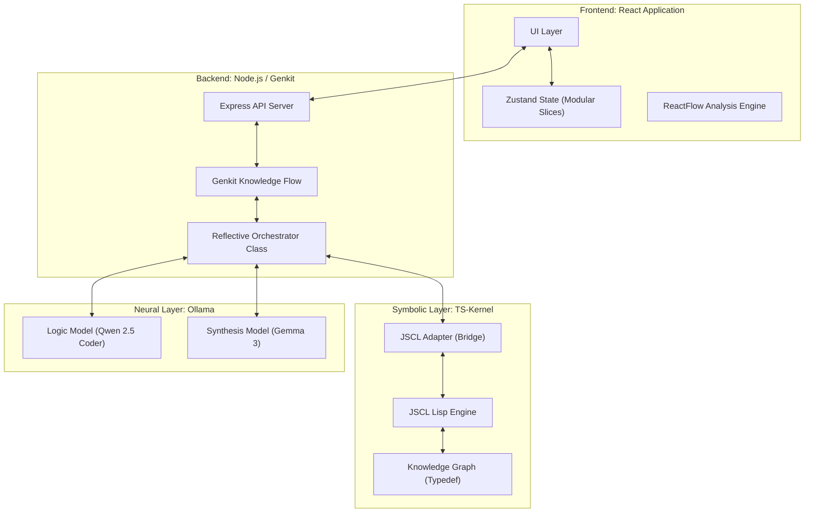
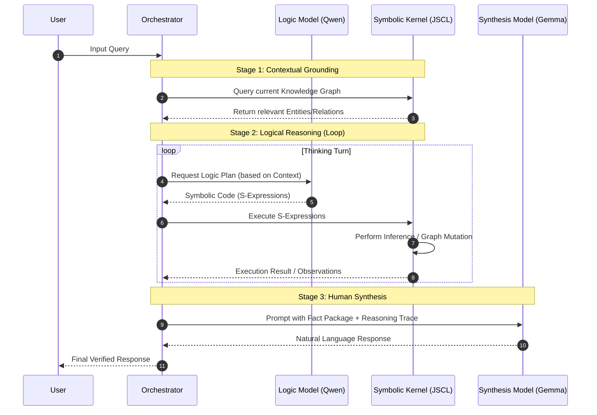
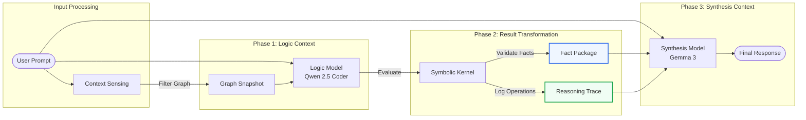
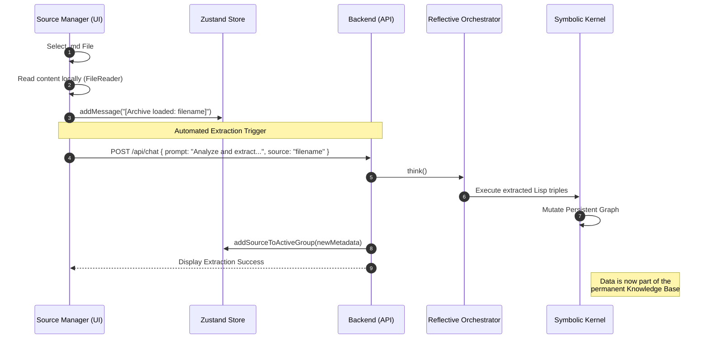

# SDialectic: Neuro-Symbolic Cognitive Architecture

SDialectic is an advanced neuro-symbolic framework designed for high-precision knowledge extraction and logical reasoning. It implements a Dual-Process architecture that bridges the creative flexibility of Large Language Models (LLMs) with the formal rigor of a Symbolic Logic Kernel.

## 1. Executive Summary: The Dual-Process Theory

The system is built upon the Dual-Process theory of cognition, distinguishing between two primary modes of processing:

1.  **System 1 (Neural Intuition)**: Handled by Generation 3 LLMs (e.g., Gemma 3, Qwen 2.5). This layer manages natural language understanding, context sensing, and creative synthesis.
2.  **System 2 (Symbolic Logic)**: Driven by the TS-Kernel (Local JSCL). This layer provides an immutable environment for formal logic, atomic fact storage, and deterministic inference.

The interaction between these layers is managed by the **Reflective Orchestrator**, ensuring that every neural intuition is grounded in symbolic truth.

---

## 2. System Architecture

The architecture is composed of three primary layers: the User Interface, the Orchestration Layer, and the Symbolic Kernel.

### 2.1 Concept: The Digital Brain (Didactic View)

### 2.2 Technical Topology

---

## 3. Core Component: The Reflective Loop

The Reflective Loop is a multi-turn cognitive process where the AI "reasons" by writing and executing symbolic code before presenting a result.

### 3.1 Interaction Sequence

---

## 4. Cognitive Specialization and Context Engineering

The system optimizes for accuracy by treating the Logic Model and the Synthesis Model as two specialized agents with distinct context windows.

### 4.1 Model Roles and Context Inputs

| Feature | Logic Model (Qwen 2.5 Coder) | Synthesis Model (Gemma 3) |
| :--- | :--- | :--- |
| **Primary Goal** | Translate natural language into formal logic. | Translate formal facts into natural language. |
| **Primary Context** | User Prompt + Current Graph Snapshot. | User Prompt + Fact Package + Reasoning Trace. |
| **Output Type** | Executable Lisp (S-Expressions). | Formatted Markdown / Natural Language. |
| **Tone** | Deterministic / Syntactic. | Explanatory / Grounded. |

### 4.2 The Context Transformation Pipeline

The diagram below illustrates how context is filtered and transformed as it moves from the unstructured user input to the final grounded response.

### 4.3 Context Injection Mechanism

1.  **Logic Injection**: The `ReflectiveOrchestrator` performs a "proximity search" on the Knowledge Graph before invoking the Logic Model. This ensures the prompt only contains entities relevant to the current conversation, preventing context overflow.
2.  **Fact Injection**: The Synthesis Model is strictly instructed to prioritize the `Fact Package`. If the Symbolic Kernel returns a "Relationship added" or "Conflict found" result, the Synthesis Model must use this as its "Ground Truth," overriding any internal neural priors.

### 4.4 Knowledge Ingestion Lifecycle

When a user introduces new raw data (specifically Markdown or Text files) via the Source Manager, the system initiates an automated extraction lifecycle.

**Key Ingestion Phases:**
1.  **Detection & Pre-processing**: The frontend identifies the file type and wraps the content in a "Structured Extraction Prompt."
2.  **Symbolic Injection**: The Logic Model analyzes the raw content and translates it into atomic `(add-node)` and `(add-relation)` commands.
3.  **Source-Graph Association**: Every ingested file is treated as a distinct "Source" but contributes to the unified Knowledge Graph of the active Group (Study Trail).
4.  **Persistent Mapping**: Metadata (Hash, Name, Date) is saved in the Zustand store, while the factual content is persisted as Lisp code in the backend data layer.

---

## 5. Key Features

### 4.1 Advanced Graph Analysis
The system includes a sophisticated visualization suite for interacting with the Knowledge Graph in real-time.
- **Dynamic Filtering**: Toggle visibility of Entities and Relations independently.
- **Predicate Filtering**: Select specific relation types (e.g., "is valid in", "causes") to isolate sub-graphs.
- **Flexible Layout**: Switch between Vertical (Top-Bottom) and Horizontal (Left-Right) views with automatic centering (Fit View).
- **High-Resolution Zoom**: Optimized for massive graphs with zoom-out capabilities up to 20x.

### 4.2 Symbolic Live Stream (Live REPL)
Every logical operation performed by the AI is streamed to the UI in real-time. This provides a "Glass Box" experience where users can monitor:
- Lisp commands being generated.
- Internal graph mutations.
- Reasoning traces and formal inference logs.

### 4.3 Resilience and Data Integrity
- **Stateless Snapshots**: The Knowledge Graph is persisted as executable Lisp code, ensuring state can be reconstructed perfectly on boot.
- **Rollback Mechanism**: If an interaction is aborted, the system automatically restores the last consistent state.
- **Sandboxed Execution**: The JSCL engine prevents neural errors from compromising system stability.

---

## 5. Technical Implementation Details

### 5.1 Symbolic Primitives
The kernel provides a set of high-level S-Expressions for the AI:
- `(add-node id type)`: Injects a unique concept into the graph.
- `(add-relation subject predicate object)`: Creates a formal triple.
- `(infer)`: Triggers the Forward Chaining engine to derive implicit facts.
- `(get-graph-snapshot)`: Telemetry for the ReactFlow engine.

### 5.2 State Management
The frontend employs a modular Zustand architecture divided into specialized slices:
- **ConfigSlice**: Governance of system flags (Memory, Bypass).
- **ChatSlice**: Thread-safe message history.
- **SourceSlice**: Document and knowledge unit management.
- **GraphSlice**: Persistent UI settings (Layout direction, filter states).

---

## 6. Technical Stack

- **Orchestration**: Node.js, Genkit, TypeScript.
- **Cognitive Layer**: Ollama (Gemma 3, Qwen 2.5 Coder).
- **Symbolic Layer**: JSCL (adapted for TS/Node side-car).
- **Frontend**: React 19, ReactFlow, Zustand, TailwindCSS, Radix UI.

---

*Copyright © 2025 SDialectic Labs. Technical Documentation Internal Release.*
