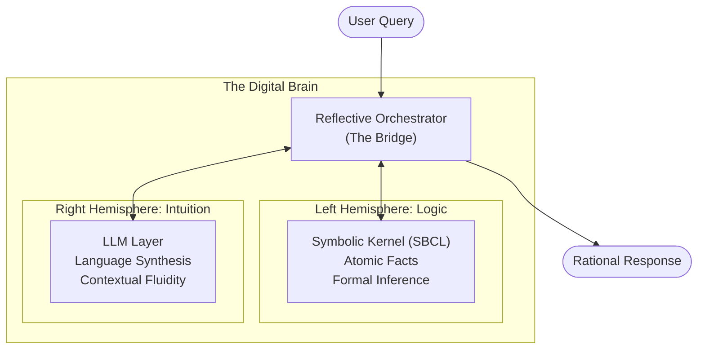
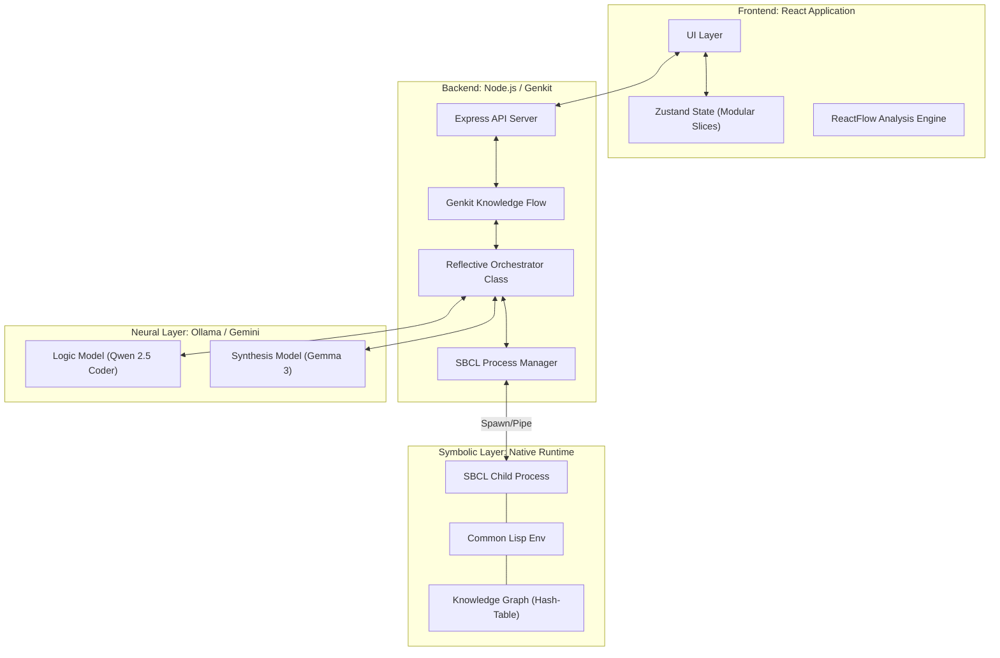
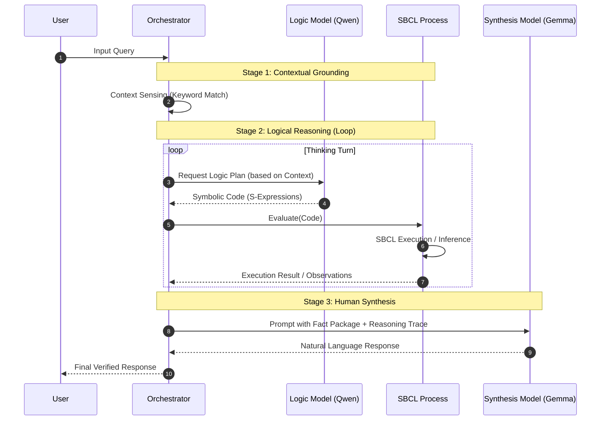
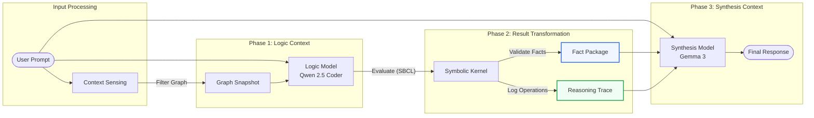

# SDialectic: Neuro-Symbolic Cognitive Architecture

SDialectic is an advanced neuro-symbolic framework designed for high-precision knowledge extraction and logical reasoning. It implements a **Dual-Process** architecture that bridges the creative flexibility of Large Language Models (LLMs) with the formal rigor of a **Native Symbolic Logic Kernel** (SBCL).

## 1. Executive Summary: The Dual-Process Theory

The system is built upon the Dual-Process theory of cognition, distinguishing between two primary modes of processing:

1.  **System 1 (Neural Intuition)**: Handled by **Generation 3 LLMs** (e.g., Gemma 3, Qwen 2.5). This layer manages natural language understanding, context sensing, and creative synthesis.
2.  **System 2 (Symbolic Logic)**: Driven by the **SBCL Kernel** (Steel Bank Common Lisp). This layer provides an immutable, high-performance environment for formal logic, atomic fact storage, and deterministic inference running as a dedicated native process.

The interaction between these layers is managed by the **Reflective Orchestrator**, ensuring that every neural intuition is grounded in symbolic truth.

---

## 2. System Architecture

The architecture is composed of three primary layers: the User Interface, the Orchestration Layer, and the Native Symbolic Kernel.

### 2.1 Concept: The Digital Brain (Didactic View)

### 2.2 Technical Topology

---

## 3. Core Component: The Reflective Loop

The Reflective Loop is a multi-turn cognitive process where the AI "reasons" by writing and executing symbolic code before presenting a result.

### 3.1 Interaction Sequence

---

## 4. Cognitive Specialization and Context Engineering

The system optimizes for accuracy by treating the Logic Model and the Synthesis Model as two specialized agents with distinct context windows.

### 4.1 Model Roles and Context Inputs

| Feature | Logic Model (Qwen 2.5 Coder) | Synthesis Model (Gemma 3) |
| :--- | :--- | :--- |
| **Primary Goal** | Translate natural language into formal logic. | Translate formal facts into natural language. |
| **Primary Context** | User Prompt + Current Graph Snapshot. | User Prompt + Fact Package + Reasoning Trace. |
| **Output Type** | Executable Lisp (S-Expressions). | Formatted Markdown / Natural Language. |
| **Tone** | Deterministic / Syntactic. | Explanatory / Grounded. |

### 4.2 The Context Transformation Pipeline

The diagram below illustrates how context is filtered and transformed as it moves from the unstructured user input to the final grounded response.

### 4.3 SBCL Process Integration

Unlike browser-based Lisp implementations, SDialectic uses a robust **Child Process** architecture:

1.  **Spawn**: The backend spawns a dedicated `sbcl` instance (`--noinform --disable-debugger`).
2.  **Bootstrap**: On startup, it loads `lisp/bootstrap.lisp` into the `:s-dialectic` package.
3.  **Sanitization**: Output from the REPL is rigorously sanitized to remove prompts (`*`), debugger info, and artifacts, ensuring clean JSON or atomic results.
4.  **Resilience**: If the Lisp process crashes or enters a debugger loop, the `SBCLProcess` manager detects the stderr pattern, aborts components, or restarts the process automatically.

---

## 5. Key Features

### 5.1 Advanced Graph Analysis
The system includes a sophisticated visualization suite for interacting with the Knowledge Graph in real-time.
- **Dynamic Filtering**: Toggle visibility of Entities and Relations independently.
- **Hybrid State**: Merges React-side "Memories" with Lisp-side "Knowledge Graph" for a unified view.
- **Flexible Layout**: Switch between Vertical (Top-Bottom) and Horizontal (Left-Right) views via ReactFlow.

### 5.2 Symbolic Live Stream (Live REPL)
Every logical operation performed by the AI is streamed to the UI in real-time via Server-Sent Events (SSE).
- Lisp commands being generated.
- Internal graph mutations.
- Reasoning traces (`(infer)`, `(add-node)`).

### 5.3 Resilience and Data Integrity
- **Rollback Mechanism**: Middleware registers connection status; if a client aborts, the graph state rolls back to the last consistent checkpoint.
- **File Cleanup**: Automated cleanup of uploaded PDFs and temporary files after extraction or failure.
- **Strict Environment**: Uses `dotenv` with strict mode validation to ensure all model configurations are present before boot.

---

## 6. Technical Stack

- **Orchestration**: Node.js, Genkit, TypeScript.
- **Cognitive Layer**: Ollama (Gemma 3, Qwen 2.5 Coder) or Google Gemini API.
- **Symbolic Layer**: **SBCL (Steel Bank Common Lisp)** via Node.js Child Process.
- **Frontend**: React 19, ReactFlow, Zustand, TailwindCSS, Radix UI.
- **State Management**: Unified `useDialecticStore` combining Config, Chat, Source, and Graph slices.

---

*Copyright © 2025 SDialectic Labs. Technical Documentation Internal Release.*
