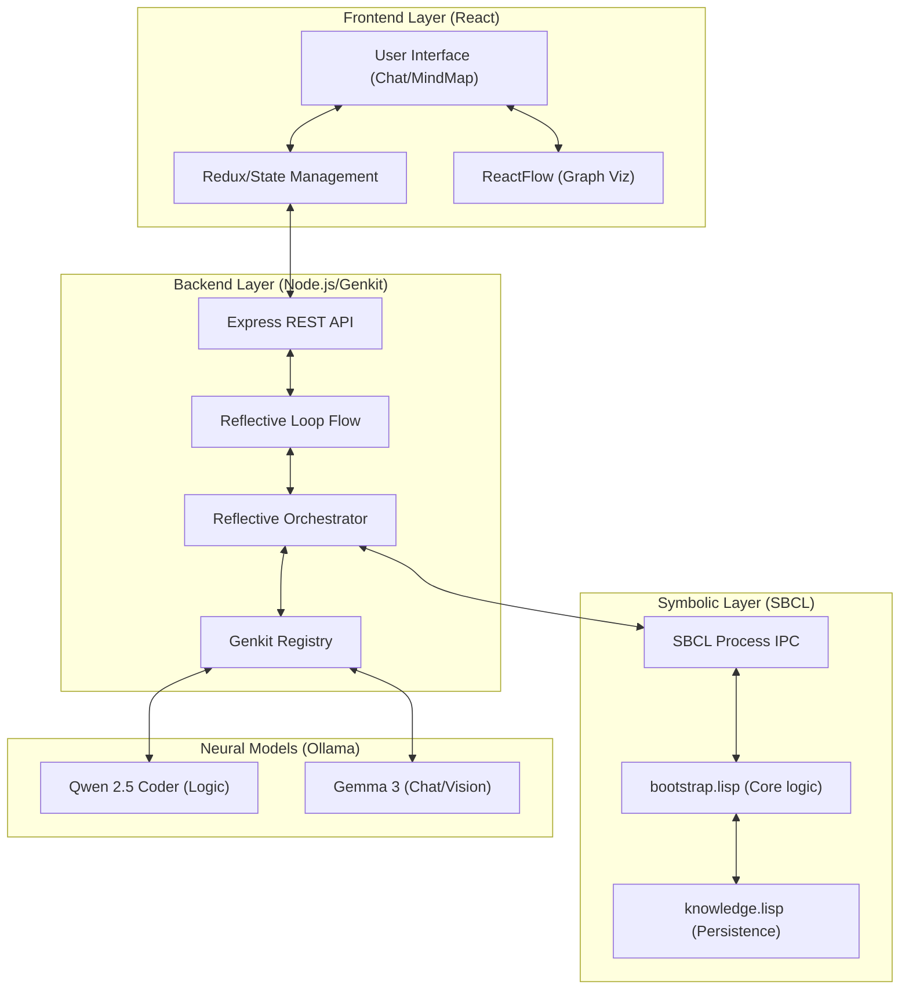
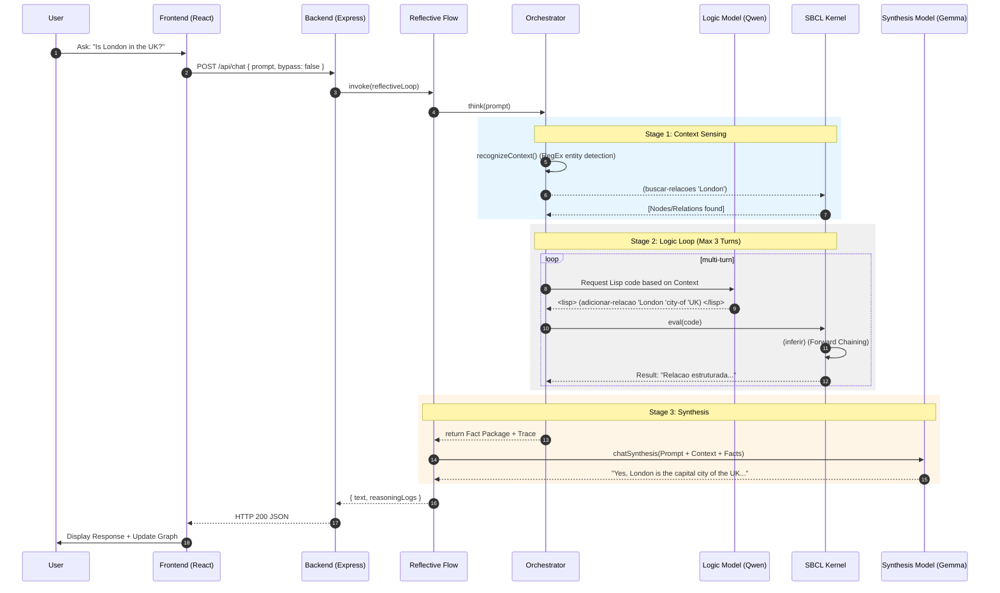
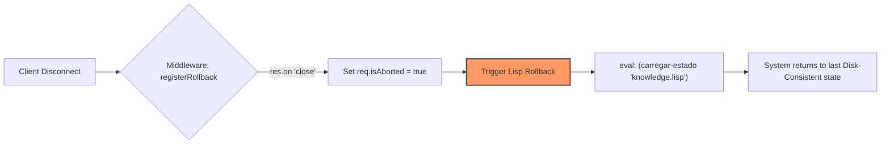
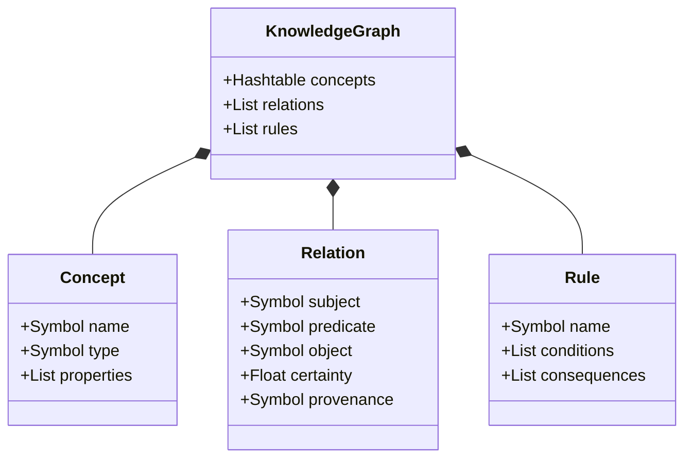

# SDialectic (Phase 2.0): Symbolic-Neural Cognitive Architecture

> **"Bridging the semantic fluidness of LLMs with the formal rigidity of Common Lisp."**

**SDialectic** is a neuro-symbolic engine designed for high-precision knowledge management. It integrates a **System 1 (Neural Intuition)** using Generation 3 LLMs with a **System 2 (Symbolic Logic)** powered by a persistent **Steel Bank Common Lisp (SBCL)** kernel.

---

## 🏗️ System Architecture: The Reflective Orchestrator

The system core features a **Reflective Orchestrator** layer (System 1.5). This middleware manages the cognitive gap between unstructured text and structured logic.

### 1. The Middleware Pipeline
1.  **Context Sensing**: Early detection of entities in the Knowledge Graph to prime the Thinking phase.
2.  **Logic Loop (Multi-Turn)**: The Logic Model (`qwen2.5-coder:3b`) writes Common Lisp code to query or modify the world state.
3.  **Fact Packaging**: Results are bundled into a structured **Fact Package** containing Logic Engine Results + Internal Reasoning Trace.
4.  **Synthesis**: The Chat Model (`gemma3:4b`) translates formal facts into natural, human-grounded language.
5.  **Bypass Mode**: Direct LLM interaction for tasks not requiring formal logic.

### 2. High-Level Topology


### 3. Deep-Dive Interaction Sequence
The diagram below illustrates the exact flow of data during a standard "Smart Chat" interaction, highlighting the multi-turn logic capability.



---

## 🛡️ Resilience and Data Integrity

The system employs a multi-layered approach to ensure that the persistent Lisp state remains consistent even during unexpected interruptions.

### 1. Abortion Protocol & Rollback
When a user stops a generation or closes the browser tab, the following sequence occurs:



### 2. Sandbox & Recovery
- **SBCL Debugger Guard**: Any Lisp error that enters the `0] ` debugger is automatically caught by `sbcl-process.ts` and cleared using the `abort` sequence.
- **Model Cleanup**: Active tracking of model usage allows for proactive memory management via `ollama/unload`.

---

## 🛠️ Core Capabilities

### Hybrid Reasoning Engine
- **Neural (System 1)**: Rapid response for general queries using Gemma 3.
- **Symbolic (System 2)**: Atomic fact storage, relational mapping, and logical inference via SBCL.
- **Bypass Toggle**: Users can choose to skip the symbolic layer for faster, non-persistent talk.

### Persistence Layer
- **Auto-Snapshots**: The Knowledge Graph is saved as executable Lisp code (`knowledge.lisp`) after every successful interaction.
- **Bootstrapping**: On server startup, the system automatically re-executes the saved Lisp script to restore the exact state.

---

## 📊 Component Topology: Symbolic Kernel

The `bootstrap.lisp` file provides the formal vocabulary for the AI:



### Key Symbolic Primitives
- `adicionar-relacao`: Direct injection of triples into the graph.
- `inferir`: Executes the Forward Chaining inference engine to derive implicit facts.
- `definir-funcao`: Allows the LLM to write NEW Lisp functions that persist in the kernel.
- `print-graph-json`: High-speed telemetry for real-time frontend visualization.

---

## 💻 Technical Stack

- **Reasoning Loop**: Node.js + Genkit + Ollama
- **Symbolic Core**: SBCL (Steel Bank Common Lisp)
- **Logic Model**: `qwen2.5-coder:3b`
- **Synthesis/Vision Model**: `gemma3:4b`
- **Frontend**: React + ReactFlow + TailwindCSS

---

# 📚 Backend Implementation Details

## 📄 File: `backend/src/server.ts`
Contains the Express entry point with **Rollback Middleware** and **SSE Stream** for REPL terminal logs.

```typescript
// Middleware to register rollback on client abortion
const registerRollback = (req: any, res: any, next: any) => {
  req.isAborted = false;
  res.on("close", () => {
    if (!res.writableEnded) {
      req.isAborted = true;
      // Rollback to last saved state to prevent memory/file corruption
      lisp.loadState("knowledge.lisp").catch((e) => {
        console.error("[Server] Rollback failed:", e);
      });
    }
  });
  next();
};

app.post("/api/chat", registerRollback, async (req: any, res: any) => {
  const result = await reflectiveLoop(req.body);
  if (req.isAborted) return;
  res.json(result);
});
```

## 📄 File: `backend/src/flows/reflective-loop.ts`
The main Genkit flow orchestrating the System 1 and System 2 interaction.

```typescript
export const reflectiveLoop = ai.defineFlow(
  { name: "reflectiveLoop", inputSchema: InputSchema },
  async (input) => {
    if (input.bypassSDialect) {
      return await directNeuralChat(input);
    }
    
    const orchestrator = new ReflectiveOrchestrator(input.prompt, input.history);
    const factPackage = await orchestrator.think();
    
    const response = await synthesisPrompt.generate({
      input: { ...input, factPackage }
    });

    await lisp.saveState("knowledge.lisp");
    return {
      text: response.text,
      reasoningLogs: orchestrator.getReasoningLogs()
    };
  }
);
```

*Copyright © 2025 SDialectic Labs. Proprietary / Stealth Beta. No Fallbacks Allowed.*
