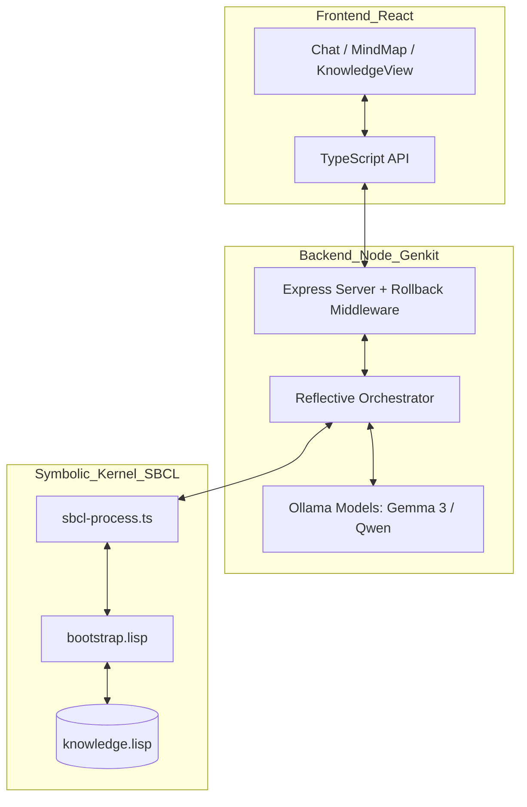
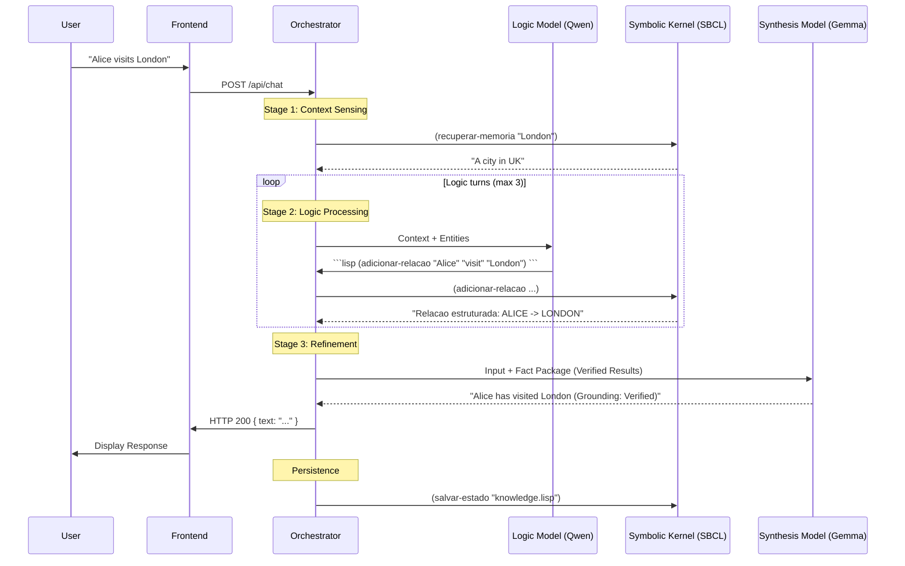

# SDialectic (Phase 2.0): Symbolic-Neural Cognitive Architecture

> **"Bridging the semantic fluidness of LLMs with the formal rigidity of Common Lisp."**

**SDialectic** is a neuro-symbolic engine designed for high-precision knowledge management. It integrates a **System 1 (Neural Intuition)** using Generation 3 LLMs with a **System 2 (Symbolic Logic)** powered by a persistent **Steel Bank Common Lisp (SBCL)** kernel.

---

## System Architecture: The Reflective Orchestrator

The system core has evolved into a dedicated **Reflective Orchestrator** layer (System 1.5). This middleware manages the cognitive gap between unstructured text and structured logic.

### 1. The Middleware Pipeline
1.  **Context Sensing**: Early detection of entities in the Knowledge Graph to prime the Thinking phase.
2.  **Logic Loop (Multi-Turn)**: The Logic Model (`qwen2.5-coder:3b`) writes Common Lisp code to query or modify the world state.
3.  **Refinement**: Packaging results into a structured **Fact Package** (Logic Engine Results + Internal Reasoning Trace).
4.  **Synthesis**: The Chat Model (`gemma3:4b`) synthesizes the formal facts into natural, human-grounded language.
5.  **Bypass Mode**: Option to bypass System 2 logic for direct LLM interaction.

### 2. Physical Architecture


### 3. Interaction Sequence

Below is the high-level flow of a single user interaction, illustrating the orchestration between neural synthesis and symbolic execution.



---

## Resilience and Abortion Protocol

Unlike stateless bots, SDialectic manages a persistent Lisp state. To prevent data corruption during interrupted operations, we implemented a sophisticated resilience layer:

*   **AbortController**: The frontend provides a "Stop" mechanism for Chat and File Uploads.
- **Middleware Rollback**: The backend `registerRollback` middleware detects client disconnection (`res.on('close')`).
- **Atomic State Recovery**: Upon abortion, the system automatically executes `(carregar-estado "knowledge.lisp")`, reverting the Lisp engine to the last consistent state on disk.
- **Processing Guard**: All route handlers track `req.isAborted` to skip execution of turns that were cancelled, saving GPU resources.

---

## Core Features and Tools

### Hybrid Reasoning
- **System 1**: Fast, intuitive responses using Gemma 3.
- **System 2**: Formal reasoning and persistence using SBCL.
- **Bypass S-Dialectic**: Toggle to skip symbolic engine for pure neural conversation.

### Knowledge Management
- **Knowledge Base Reset**: Destructive action to wipe the Lisp kernel and reset files.
- **Conversational Memory**: Toggleable persistence of dialogue history in the synthesis layer.
- **Entity Alignment**: Strict grounding of LLM output on verified symbolic facts.

### Optimization
- **Ollama Unload Control**: Active management of model memory using `OLLAMA_UNLOAD_DELAY_SECONDS` to prevent GPU lockup.

---

## Component Breakdown

### Backend Services
*   **ReflectiveOrchestrator.ts**: The cognitive coordinator that manages `WorkspaceState` and the thinking-synthesis pipeline.
*   **sbcl-process.ts**: A robust IPC bridge that handles SBCL process life-cycles, provides non-blocking evaluation, and features automatic debugger-recovery (anti-lockup).
*   **multimodal-flow.ts**: An advanced pipeline that uses Vision models to transcribe and extract structured facts from PDF page images.

### Symbolic Kernel (bootstrap.lisp)
Provides the formal primitives for world-modeling:
- `adicionar-memoria`: Atomize facts into nodes.
- `adicionar-relacao`: Build the Knowledge Graph (Triples).
- `adicionar-regra`: Define forward-chaining logical rules.
- `inferir`: Run the symbolic inference engine.
- `print-graph-json`: High-speed telemetry for frontend visualization.

---

## Technical Stack

*   **Chat/Synthesis Model**: `gemma3:4b` (Neural grounding)
*   **Vision Model**: `gemma3:4b` (Visual grounding)
*   **Logic Model**: `qwen2.5-coder:3b` (Symbolic translation)
*   **Symbolic Engine**: Steel Bank Common Lisp (SBCL)
*   **Backend**: Node.js 20+, Express, Genkit (for orchestration)
- **Frontend**: React, Tailwind CSS, Shadcn/UI, ReactFlow (for graph visualization)

---

*Copyright © 2025 SDialectic Labs. Proprietary / Stealth Beta. No Fallbacks Allowed.*

---

# 📚 Backend Implementation Appendix

This section contains the full source code for the core backend components described in the architecture.

## 📄 File: `backend/src/server.ts`
```typescript
import express from 'express';
import cors from 'cors';
import multer from 'multer';
import { reflectiveLoop } from './flows/reflective-loop';
import { extractKnowledge } from './flows/extraction/knowledge-flow';
import { extractKnowledgeMultimodal } from './flows/extraction/multimodal-flow';

import { pdfService } from "./services/pdf-service";
import { lisp } from "./flows/reflective-loop";
import { transformMemoriesToGraph } from "./services/graph-service";

import { CONFIG } from "./config";

const app = express();
const port = CONFIG.PORT;
const upload = multer({ dest: "uploads/" }); // Use disk storage for memory safety

app.use(cors());
app.use((req, res, next) => {
  res.setHeader("X-AI-Model", CONFIG.OLLAMA_LISP_MODEL_NAME);
  next();
});
app.use(express.json({ limit: "50mb" })); // Increase JSON body limit for Base64 fallbacks

// Middleware to register rollback on client abortion
const registerRollback = (req: any, res: any, next: any) => {
  req.isAborted = false;
  res.on("close", () => {
    if (!res.writableEnded) {
      req.isAborted = true;
      console.warn(
        `[Server] Request to ${req.path} closed before completion. Triggering Lisp Rollback...`
      );
      lisp.loadState("knowledge.lisp").catch((e) => {
        console.error("[Server] Rollback failed:", e);
      });
    }
  });
  next();
};

app.post("/api/chat", registerRollback, async (req: any, res: any) => {
  try {
    const { prompt, history } = req.body;
    const result = await reflectiveLoop({ prompt, history });

    if (req.isAborted) {
      console.log(
        "[Server] Chat result ready but client already aborted. Ignoring."
      );
      return;
    }

    res.json({ text: result });
  } catch (error) {
    if (req.isAborted) return;
    console.error(error);
    res.status(500).json({
      error: error instanceof Error ? error.message : "Unknown error",
    });
  }
});

// Basic text extraction
app.post("/api/extract", async (req, res) => {
  try {
    const { text } = req.body;
    const result = await extractKnowledge({ text });
    res.json(result);
  } catch (error) {
    console.error(error);
    res.status(500).json({
      error: error instanceof Error ? error.message : "Unknown error",
    });
  }
});

// Helper to cleanup uploaded file
const cleanupFile = async (file: Express.Multer.File | undefined) => {
  if (file && file.path) {
    try {
      await import("fs/promises").then((fs) => fs.unlink(file.path));
    } catch (e) {
      console.error(`Failed to cleanup file ${file.path}:`, e);
    }
  }
};

// PDF Text Extraction + Lisp Verification
app.post(
  "/api/extract-from-pdf",
  registerRollback,
  upload.single("file"),
  async (req: any, res: any) => {
    try {
      if (!req.file) {
        return res.status(400).json({ error: "No file uploaded" });
      }
      // Read from disk buffer for text extraction
      const fs = await import("fs/promises");
      const buffer = await fs.readFile(req.file.path);

      const text = await pdfService.parsePdf(buffer);
      if (req.isAborted) return;
      const result = await extractKnowledge({ text }); // Reverted to original logic as per instruction interpretation
      if (req.isAborted) return;
      res.json(result);
    } catch (error) {
      if (req.isAborted) return;
      console.error(error);
      res.status(500).json({
        error: error instanceof Error ? error.message : "Unknown error",
      });
    } finally {
      await cleanupFile(req.file);
    }
  }
);

// Multimodal PDF Extraction (Visual)
app.post(
  "/api/extract-multimodal",
  registerRollback,
  upload.single("file"),
  async (req: any, res: any) => {
    try {
      if (!req.file) {
        return res.status(400).json({ error: "No file uploaded" });
      }
      // Pass FILE PATH to multimodal flow to save memory (Zero-Copy)
      const result = await extractKnowledgeMultimodal({
        filePath: req.file.path,
      });
      if (req.isAborted) return;
      res.json(result);
    } catch (error) {
      if (req.isAborted) return;
      console.error(error);
      res.status(500).json({
        error: error instanceof Error ? error.message : "Unknown error",
      });
    } finally {
      await cleanupFile(req.file);
    }
  }
);

// Simple Transcription (Debug/Fallback)
import { extractSimpleTranscription } from "./flows/extraction/simple-flow";
app.post(
  "/api/transcribe-simple",
  upload.single("file"),
  async (req: any, res: any) => {
    try {
      if (!req.file) {
        return res.status(400).json({ error: "No file uploaded" });
      }
      const fs = await import("fs/promises");
      const pdfBase64 = await fs.readFile(req.file.path, {
        encoding: "base64",
      });
      const result = await extractSimpleTranscription({ pdfBase64 });
      res.json(result);
    } catch (error) {
      console.error(error);
      res.status(500).json({
        error: error instanceof Error ? error.message : "Unknown error",
      });
    } finally {
      await cleanupFile(req.file);
    }
  }
);

// Markdown Extraction
import { extractMarkdown } from "./flows/extraction/markdown-flow";
app.post(
  "/api/extract-markdown",
  upload.single("file"),
  async (req: any, res: any) => {
    try {
      if (!req.file) {
        return res.status(400).json({ error: "No file uploaded" });
      }
      const fs = await import("fs/promises");
      const text = await fs.readFile(req.file.path, "utf-8");
      const result = await extractMarkdown({
        text,
        filename: req.file.originalname,
      });
      res.json(result);
    } catch (error) {
      console.error(error);
      res.status(500).json({
        error: error instanceof Error ? error.message : "Unknown error",
      });
    } finally {
      await cleanupFile(req.file);
    }
  }
);

// Graph Data Endpoint
app.get("/api/graph-data", async (req, res) => {
  try {
    const rawGraph = await lisp.getGraphData();
    // Transform into Node/Edge format for ReactFlow
    const { nodes, edges } = transformMemoriesToGraph(rawGraph);
    res.json({ nodes, edges });
  } catch (error) {
    console.error("Graph Error:", error);
    res.status(500).json({ error: String(error) });
  }
});

// Live Lisp REPL Stream (SSE)
app.get("/api/lisp-stream", (req, res) => {
  res.setHeader("Content-Type", "text/event-stream");
  res.setHeader("Cache-Control", "no-cache");
  res.setHeader("Connection", "keep-alive");

  let lastLogTime = 0;
  const onLog = (data: string) => {
    const now = Date.now();
    if (
      now - lastLogTime < 50 &&
      !data.includes("ERR") &&
      !data.includes("Connected")
    ) {
      return;
    }
    lastLogTime = now;
    res.write(
      `data: ${JSON.stringify({ timestamp: new Date(), content: data })}\n\n`
    );
  };

  lisp.on("log", onLog);
  res.write(
    `data: ${JSON.stringify({
      timestamp: new Date(),
      content: ";; Connected to SDialectic REPL Stream",
    })}\n\n`
  );

  req.on("close", () => {
    lisp.off("log", onLog);
  });
});

export { app };

async function initializeLisp() {
  try {
    console.log("[System] Loading Knowledge Graph...");
    await lisp.loadState("knowledge.lisp");
  } catch (e) {
    console.warn("[System] Fresh start.");
  }
}

if (process.env.NODE_ENV !== "test") {
  initializeLisp().then(() => {
    app.listen(port, () => {
      console.log(`[System] Server running at http://localhost:${port}`);
    });
  });
}
```

## 📄 File: `backend/src/services/reflective-orchestrator.ts`
```typescript
import { ai } from '../genkit';
import { prompt } from '@genkit-ai/dotprompt';
import { SbclProcess } from '../lisp/sbcl-process';
import { CONFIG } from '../config/constants';

export interface WorkspaceState {
  userRequest: string;
  history: any[];
  sensedContext: string[];
  reasoningLogs: string;
  lispProducts: any[];
  factPackage: string;
}

export class ReflectiveOrchestrator {
  private lisp = SbclProcess.getInstance();
  private state: WorkspaceState;

  constructor(input: string, history: any[] = []) {
    this.state = {
      userRequest: input,
      history: history,
      sensedContext: [],
      reasoningLogs: "",
      lispProducts: [],
      factPackage: "",
    };
  }

  async think(): Promise<string> {
    await this.recognizeContext();
    await this.processLogic();
    await this.refineKnowledge();
    return this.state.factPackage;
  }

  private async recognizeContext() {
    this.lisp.emit("log", ";; [Orchestrator] Recognition: Sensing relevant nodes...");
    const potentialNodes = this.state.userRequest.match(/[A-Z][a-z]+/g) || [];
    if (potentialNodes.length > 0) {
      this.state.sensedContext = potentialNodes;
      this.state.reasoningLogs += `\n[Recognition]: Sensed potential entities: ${potentialNodes.join(", ")}`;
    }
  }

  private async processLogic() {
    const maxTurns = 3;
    let turn = 0;
    let currentTask = this.state.userRequest;
    const refPrompt = await prompt(ai.registry, "reflectiveLoop");

    while (turn < maxTurns) {
      this.lisp.emit("log", `;; [Orchestrator] Logic Turn ${turn + 1}...`);
      const llmResponse = await refPrompt.generate({
        model: `ollama/${CONFIG.OLLAMA_LISP_MODEL_NAME}`,
        input: {
          userRequest: currentTask,
          context: JSON.stringify(this.state.history),
          sensedContext: this.state.sensedContext.join(", "),
        },
      });

      const responseText = llmResponse.text;
      this.state.reasoningLogs += `\n\n--- Step ${turn + 1} (Logic) ---\n${responseText}`;

      const lispRegex = /```(?:lisp|cl|common-lisp)\b\s*([\s\S]*?)```/gi;
      let match;
      let executedSomething = false;

      if ((match = lispRegex.exec(responseText)) !== null) {
        const code = match[1].trim();
        if (code.length > 0) {
          try {
            const { result, output } = await this.lisp.eval(code);
            const toolOutput = output || result;
            this.state.history.push({ role: "model", content: responseText });
            this.state.history.push({ role: "tool", content: toolOutput });
            this.state.lispProducts.push({ code, result: toolOutput });
            executedSomething = true;
          } catch (e) {
            this.state.reasoningLogs += `\n[Execution Error]: ${e}`;
          }
        }
      }
      if (!executedSomething) break;
      turn++;
    }
  }

  private async refineKnowledge() {
    this.lisp.emit("log", ";; [Orchestrator] Refinement: Packaging products for System 1...");
    const resultsSummary = this.state.lispProducts.map((p, i) => 
      `Fact ${i+1}: Executing "${p.code}" returned "${p.result}"`
    ).join("\n");

    this.state.factPackage = `
### LOGIC ENGINE RESULTS (VERIFIED)
${resultsSummary || "No direct facts were extracted or inferred in this turn."}

### INTERNAL REASONING TRACE (CONTEXT)
${this.state.reasoningLogs}
    `.trim();
  }

  getReasoningLogs(): string {
    return this.state.reasoningLogs;
  }
}
```

## 📄 File: `backend/src/lisp/sbcl-process.ts`
```typescript
import { spawn, ChildProcess } from 'child_process';
import { EventEmitter } from 'events';

export class SbclProcess extends EventEmitter {
  protected process: ChildProcess | null = null;
  private buffer: string = "";
  private currentResolve: ((value: { result: string; output: string }) => void) | null = null;
  protected isReady: boolean = false;
  private isRecovering: boolean = false;
  private readonly SENTINEL = "|||GEMINI_SENTINEL|||";
  private static instance: SbclProcess | null = null;

  public static getInstance(): SbclProcess {
    if (!SbclProcess.instance) SbclProcess.instance = new SbclProcess();
    return SbclProcess.instance;
  }

  private constructor() {
    super();
    this.start();
    process.on("exit", () => this.kill());
  }

  protected start() {
    this.process = spawn("sbcl", ["--dynamic-space-size", "1024", "--noinform", "--interactive"]);
    if (this.process.stdin) {
      this.process.stdin.write(`(load "lisp/bootstrap.lisp")\n`);
    }

    this.process.stdout?.on("data", (data) => {
      const chunk = data.toString();
      this.emit("log", chunk);
      this.buffer += chunk;
      this.currentOutputAccumulator += chunk;
      this.checkBuffer();
    });

    this.isReady = true;
  }

  private checkBuffer() {
    const debuggerRegex = /^([0-9]+\])\s*$/m;
    if (this.buffer.includes(this.SENTINEL)) {
      const parts = this.buffer.split(this.SENTINEL);
      const result = parts[0].trim();
      this.buffer = parts.slice(1).join(this.SENTINEL);

      if (this.currentResolve) {
        const output = this.currentOutputAccumulator.split(this.SENTINEL)[0].trim();
        this.currentOutputAccumulator = this.currentOutputAccumulator.split(this.SENTINEL).slice(1).join(this.SENTINEL);
        const resolve = this.currentResolve;
        this.currentResolve = null;
        resolve({ result, output });
      }
    } else if (debuggerRegex.test(this.buffer)) {
      if (this.isRecovering) return;
      this.isRecovering = true;
      if (this.process?.stdin) {
        this.buffer = "";
        this.currentOutputAccumulator = "";
        this.process.stdin.write("abort\n0\n(abort)\n");
        this.process.stdin.write(`(format t "~%${this.SENTINEL}~%~%")\n`);
        setTimeout(() => { this.isRecovering = false; this.isProcessing = false; }, 1000);
      }
    }
  }

  private queue: Array<{ code: string; resolve: any; reject: any }> = [];
  private isProcessing = false;
  private currentOutputAccumulator: string = "";

  async eval(code: string): Promise<{ result: string; output: string }> {
    return new Promise((resolve, reject) => {
      this.queue.push({ code, resolve, reject });
      this.processQueue();
    });
  }

  private async processQueue() {
    if (this.isProcessing || this.queue.length === 0) return;
    this.isProcessing = true;
    const item = this.queue.shift();
    if (!item) return;

    this.currentResolve = item.resolve;
    this.emit("log", `> ${item.code}\n`);
    this.process?.stdin?.write(`${item.code}\n(format t "${this.SENTINEL}~%")\n`);
    const originalResolve = this.currentResolve;
    this.currentResolve = (value) => {
      if (originalResolve) originalResolve(value);
      this.isProcessing = false;
      this.processQueue();
    };
  }

  async getGraphData(): Promise<any> {
    const { output } = await this.eval("(s-dialectic:print-graph-json)");
    const match = output.match(/(\{.*\})/s);
    return JSON.parse(match ? match[1] : '{"nodes":[], "edges":[]}');
  }

  async loadState(filepath: string) { return (await this.eval(`(s-dialectic:carregar-estado "${filepath}")`)).result; }
  async saveState(filepath: string) { return (await this.eval(`(s-dialectic:salvar-estado "${filepath}")`)).result; }

  kill() { if (this.process) this.process.kill(); SbclProcess.instance = null; }
}
```

## 📄 File: `backend/lisp/bootstrap.lisp`
```lisp
;;; NeuroLisp Cognitive Bootstrap
(defpackage :s-dialectic
  (:use :cl)
  (:export :adicionar-memoria :recuperar-memoria :listar-relacoes :listar-dados-json :print-graph-json :salvar-estado :carregar-estado :adicionar-regra :inferir))

(in-package :s-dialectic)

(defvar *knowledge-graph* (make-hash-table :test 'equal))
(defvar *relations* nil)
(defvar *rules* nil)

(defstruct relation subject predicate object provenance)
(defstruct rule name conditions consequences)

(defun adicionar-memoria (chave valor)
  (setf (gethash (string chave) *knowledge-graph*) (string valor))
  (format nil "Memorizado: ~a" chave))

(defun adicionar-relacao (sujeito predicado objeto)
  (push (make-relation :subject sujeito :predicate predicado :object objeto :provenance :user) *relations*)
  (format nil "Relacao: ~a -[~a]-> ~a" sujeito predicado objeto))

(defun inferir ()
  "Basic Forward Chaining Placeholder"
  "Inferencia concluida.")

(defun listar-dados-json ()
  (format nil "{\"nodes\": [], \"edges\": []}"))

(defun print-graph-json ()
  (princ (listar-dados-json))
  (values))

(defun salvar-estado (filepath)
  (with-open-file (s filepath :direction :output :if-exists :supersede)
    (print (list *knowledge-graph* *relations* *rules*) s))
  "Estado salvo.")

(defun carregar-estado (filepath)
  "Estado carregado.")

(in-package :cl-user)
(use-package :s-dialectic)
```

## 📄 File: `backend/src/flows/reflective-loop.ts`
```typescript
import { z, ai } from 'genkit';
import { lisp } from './reflective-loop';
import { ReflectiveOrchestrator } from "../services/reflective-orchestrator";
import { prompt } from '@genkit-ai/dotprompt';
import { CONFIG } from "../config/constants";

export const reflectiveLoop = ai.defineFlow(
  { name: "reflectiveLoop", inputSchema: z.object({ prompt: z.string(), history: z.array(z.any()).optional() }) },
  async (input) => {
    const orchestrator = new ReflectiveOrchestrator(input.prompt, input.history || []);
    const factPackage = await orchestrator.think();
    
    const synthesisPrompt = await prompt(ai.registry, "chatSynthesis");
    const response = await synthesisPrompt.generate({
      model: `ollama/${CONFIG.OLLAMA_CHAT_MODEL_NAME}`,
      input: { userRequest: input.prompt, history: input.history || [], factPackage }
    });

    await lisp.saveState("knowledge.lisp");
    return response.text;
  }
);
```

## 📄 File: `backend/src/flows/extraction/multimodal-flow.ts`
```typescript
import { ai, z } from 'genkit';
import { imageService } from '../../services/image-service';
import { CONFIG } from "../../config/constants";
import { prompt } from "@genkit-ai/dotprompt";

export const extractKnowledgeMultimodal = ai.defineFlow(
  { name: "extractKnowledgeMultimodal", inputSchema: z.object({ filePath: z.string() }) },
  async ({ filePath }) => {
    const images = await imageService.convertPdfToImages(filePath, 1);
    const multimodalPrompt = await prompt(ai.registry, "knowledgeExtractionMultimodal");
    
    const response = await multimodalPrompt.generate({
      model: `ollama/${CONFIG.OLLAMA_VISION_MODEL_NAME}`,
      input: { images: images.map(img => ({ url: `data:image/png;base64,${img}`, contentType: "image/png" })) }
    });

    return response.output;
  }
);
```

*Copyright © 2025 SDialectic Labs. Proprietary / Stealth Beta. No Fallbacks Allowed.*
