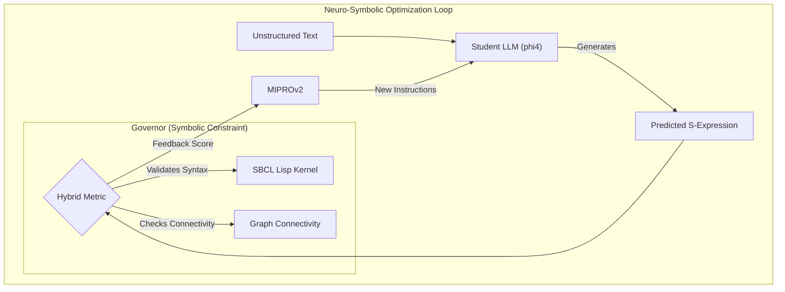
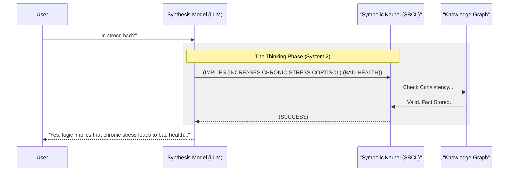

# SDialectic Core v2.0 (Sovereign AI)

> **Status:** Incipient Personal Research Project (Experimental).
> 
> This repository hosts the experimental Python/DSPy core for the **Neuro-Symbolic Cognitive Architecture**. It is not a commercial product, but a "Digital Brain" prototype designed to bridge the gap between Neural Intuition (LLMs) and Symbolic Truth (Formal Logic).

## 1. Project Vision

SDialectic is an experiment in **High-Precision Knowledge Extraction**. The hypothesis is simple but radical: **Language Models should not be trusted with truth; they should be trusted with translation.**

Instead of asking an LLM to "reason" (which often leads to hallucinations), we treat the LLM as a **Semantic Transpiler**: its only job is to translate natural language into **Common Lisp S-Expressions**.

Once the thought is converted into code, it is executed by a **Native Symbolic Kernel (SBCL)**. If the logic holds, it is accepted. If it contradicts existing axioms, it is rejected. This creates a "Governor" mechanism that enforces reality constraints on the AI's imagination.

It has no frontend yet, so it's tested via python and shell scripts.

---

## 2. Neuro-Symbolic Architecture

The system follows a strict **Teacher-Student-Governor** architecture, optimized via the **DSPy** framework.

### 2.1 The Optimization Loop (MIPROv2)

We use a "Compile-and-Optimize" approach. We don't write prompts by hand; we *program* the optimizer to find the best prompt that satisfies the Logic Kernel.



### 2.2 The "Reflective Loop"

Unlike standard RAG, SDialectic implements a persistent feedback loop where the AI "thinks" in Lisp code before speaking.



---

## 3. Experiments & Results

### Exp 1: Logical Narrative Optimization (FOLIO Dataset)
*Status: Completed on 2026-01-18*

We engaged in a large-scale optimization run using the **FOLIO** dataset (First-Order Logic for Instruction Optimization) to train our local model (phi4-mini) to think like a logician.

**The "Emergent Prompt" Phenomenon:**
Instead of us telling the AI how to write Lisp, the `MIPROv2` optimizer discovered highly specific technical instructions that maximize passing rates in the SBCL compiler:

> *"Convert complex narrative text into symbolic logic represented as valid Common Lisp S-Expressions... Ensure UPPERCASE notation... the output should be a list of lists parseable via SBCL."*

**Performance:**
- **Final Score:** 100.0 (Validation Set).
- **Resilience:** The model learned to perform "snake_case" sanitization (`LAWYER_JAMES_COCKS`) purely through feedback from the Lisp Kernel's error logs.

---

## 4. Technical Stack (Jan 2026)

This project runs on a "Sovereign Stack" principle—fully capable of running offline on consumer hardware, but scalable to the cloud.

*   **Orchestration:** Python 3.12 + DSPy 3.1
*   **Symbolic Kernel:** SBCL 2.6.0 (Steel Bank Common Lisp)
    *   *Why SBCL?* Unmatched performance, true compilation, and a robust REPL for persistent memory.
*   **Teacher Model:** Google Gemini 2.5 Flash lite [to be changed in experiments] (Cloud)
*   **Student Model:** Microsoft Phi-4 [to be changed in experiments]  (Local via Ollama)
*   **Vector Database:** Local ChromaDB (Planned)

---

## 5. Deployment & Scalability (Roadmap)

To verify these results at scale without melting our laptops, we are developing a **Static Binary Injection** strategy for cloud environments like Kaggle and Colab.

1.  **Local Build:** We cross-compile the entire Lisp environment (SBCL + Quicklisp + Libraries) into a single, static binary file using `sb-ext:save-lisp-and-die`.
2.  **Cloud Injection:** This binary is uploaded as a generic "Dataset".
3.  **Execution:** The notebook simply copies the binary and runs it. No `apt-get`, no compilation, no root permissions needed.

---

## 6. Installation & Usage

**Prerequisites:**
- Conda
- SBCL installed (`brew install sbcl` or `sudo apt install sbcl`)
- Ollama running (`ollama serve`)

**Setup:**
```bash
conda env create -f environment.yml
conda activate sdialectic-env
cp .env.example .env  # Add your keys
```

**Run Inference:**
```bash
python main.py
```
