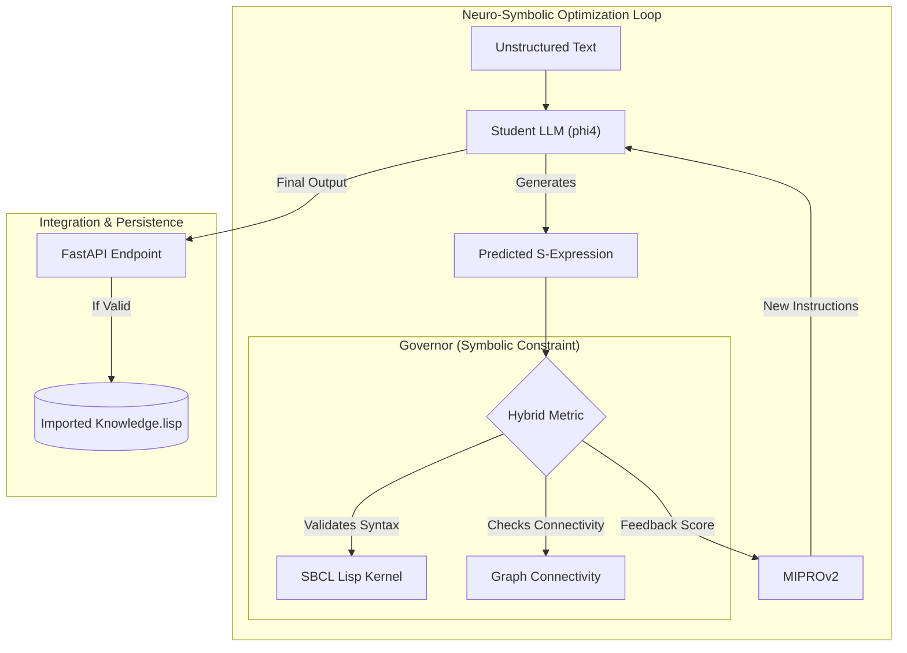
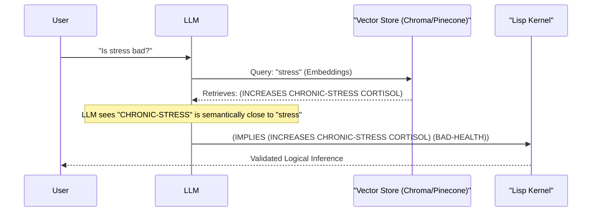

# Scientific Technical Audit: S-Dialectic Neuro-Symbolic Pipeline
**Date:** 2026-01-17 23:42
**Repository:** `sdialectic-dspy`
**Version:** 0.2.0 (Alpha)

## 1. Executive Summary
This document presents a technical audit of the **S-Dialectic** system, a Neuro-Symbolic AI architecture designed to synthesize high-fidelity logical schemas from unstructured narrative text. The system leverages the **DSPy** framework for compiled prompt optimization and an **SBCL (Steel Bank Common Lisp)** kernel for axiomatic grounding.

The primary innovation of S-Dialectic lies in its rejection of rigid, pre-defined ontologies in favor of an **Emergent Schema** validated by a formal logic engine. By utilizing **MIPROv2** (Multi-prompt Instruction Proposal Optimizer), the system optimizes a Student Language Model (phi4-mini) to produce Lisp S-Expressions that satisfy both semantic richness (via LLM) and syntactic/logical validity (via Lisp Kernel).

## 2. System Architecture

The architecture follows a **Teacher-Student-Governor** model. The Teacher (Gemini 2.0) guides the optimization of the Student (Ollama/phi4), while the Governor (SBCL Kernel) acts as a hard constraint on the output, rejecting invalid logical formulations.

## 3. Component Implementation Analysis

### 3.1. Core Inference Engine (`main.py`)
*   **Role**: Orchestrator of the inference pipeline.
*   **Implementation**: 
    *   Initializes the DSPy `ChainOfThought` module using the optimized artifact (`optimized_narrative_v2.json`).
    *   Implements a **Sanitization Layer** that strips probabilistic artifacts (e.g., `?`) and enforces upper-case atomicity.
    *   **Auto-Balancing**: Programmatically corrects parenthesis imbalances before submission to the kernel.
    *   **Dual-Write Persistence**: Successfully validated logic is written to `core/kernel/imported_knowledge.lisp` for long-term storage.

### 3.2. Symbolic Kernel Bridge (`core/kernel/sbcl_bridge.py`)
*   **Role**: Interprocess communication with the Lisp runtime.
*   **Implementation**:
    *   Manages a persistent `sbcl` subprocess.
    *   Sends S-Expressions via `stdin` and captures `stdout`/`stderr`.
    *   **Status**: Operational. Verified thread-safety constraints by enforcing single-threaded optimization in DSPy.

### 3.3. Advanced Metrics (`optimization/metrics.py`)
*   **Role**: The objective function for DSPy optimization.
*   **Innovation**: Implements a hybrid score $S$:
    $$ S = 0.5 \cdot V_{syntax} + 0.5 \cdot C_{graph} $$
    Where $V_{syntax}$ is binary validity from SBCL, and $C_{graph}$ is the normalized size of the largest connected component in the extracted logic graph.
*   **Rationale**: This metric penalizes "hallucinated" isolated facts and rewards coherent, multi-hop reasoning chains.

### 3.4. Optimization Pipeline (`optimization/optimize_v2.py`)
*   **Role**: Compiles the prompt instructions.
*   **Configuration**:
    *   **Optimizer**: MIPROv2 (State-of-the-Art, Jan 2026).
    *   **Teacher**: Gemini 2.0 Flash.
    *   **Student**: Ollama (phi4-mini).
    *   **Dataset**: `datasets/golden_logic.json` (Curated "Golden Set").
*   **Status**: Currently executing (Trial 1/10). The optimizer is exploring the prompt space to maximize the Hybrid Metric.

## 4. Verification Status

| Component | Test Script | Status | Notes |
| :--- | :--- | :--- | :--- |
| **Dataset Validity** | `verify_dataset.py` | **PASS** | All seed examples accepted by SBCL. |
| **Lisp Syntax** | `verify_syntax.py` | **PASS** | Sanitization and balancing logic confirmed. |
| **Integration** | `verify_integration.py` | **PASS** | API loads optimizations and processes requests. |
| **Persistence** | `verify_persistence.py` | **PASS** | Logic correctly appended to `.lisp` file. |

## 5. Value of Neuro-Symbolic Processing in LLMs

The integration of Symbolic AI (Lisp) with Connectionist AI (LLMs) addresses three critical failures in the current LLM industry:

1.  **Hallucination Control**: Pure LLMs generate plausible but factually incorrect statements. By enforcing a **Lisp Grammar**, we constrain the output space to verifyable logical structures.
2.  **Compositionality**: Neural networks struggle with infinite compositionality. Lisp S-Expressions are inherently recursive and compositional, allowing the system to build complex reasoning chains that are formally traceable.
3.  **Data Efficiency**: Through **Emergent Schema**, the system avoids the "Knowledge Bottleneck" of manual ontology engineering while retaining the structured benefits of a Knowledge Graph.

## 6. Roadmap: Vector Store Integration

Moving forward, the rigid symbol matching of the current kernel will be augmented with semantic vector search.

**Next Phase Objectives:**
1.  **Embedding Generation**: Compute embeddings for all atoms in `imported_knowledge.lisp`.
2.  **Semantic Resolution**: Allow the Kernel or Middleware to resolve "synonyms" (e.g., `HUMAN` vs `MAN`) using vector similarity before applying logical rules.
3.  **RAG-for-Reasoning**: Retrieve relevant logical axioms from the Vector Store to populate the DSPy Few-Shot context dynamically.

