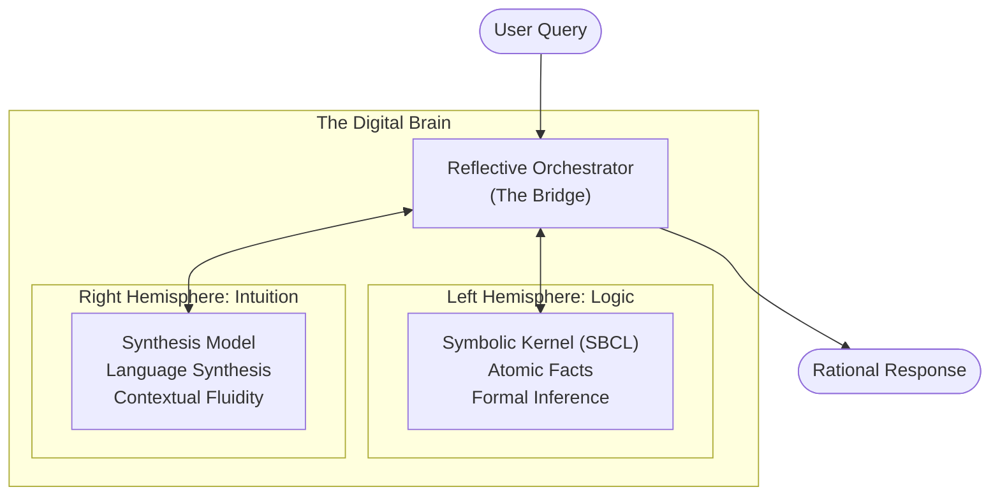
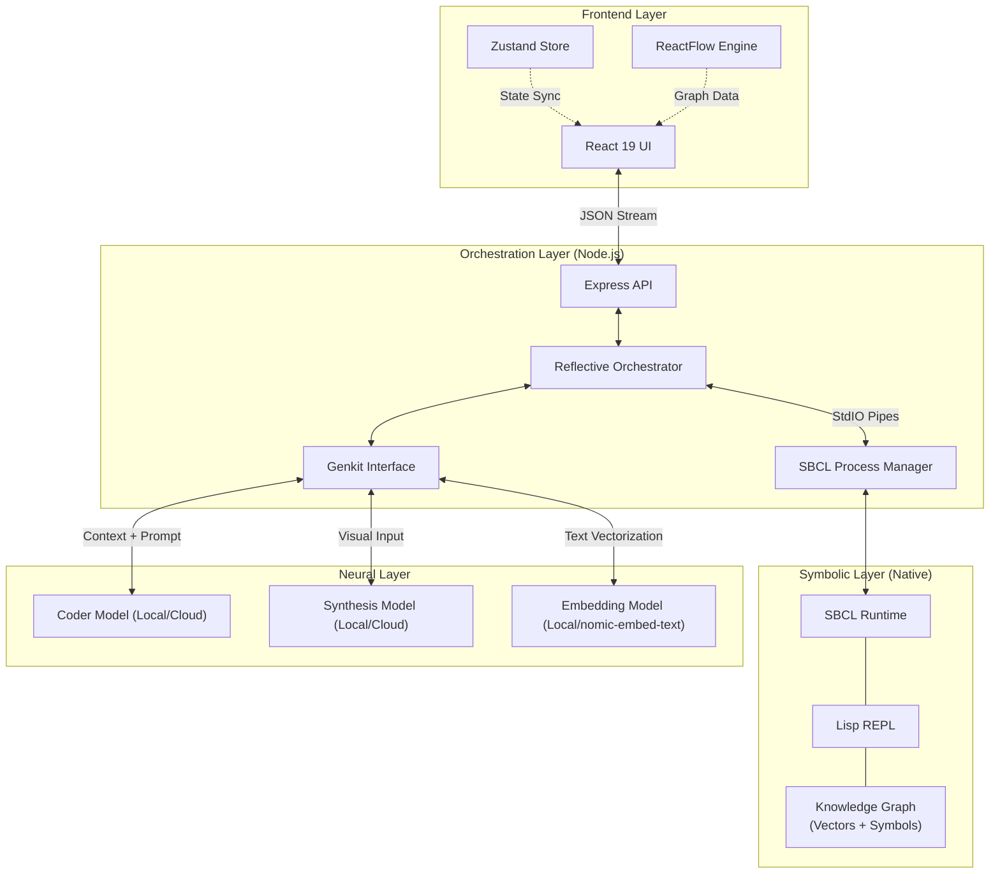
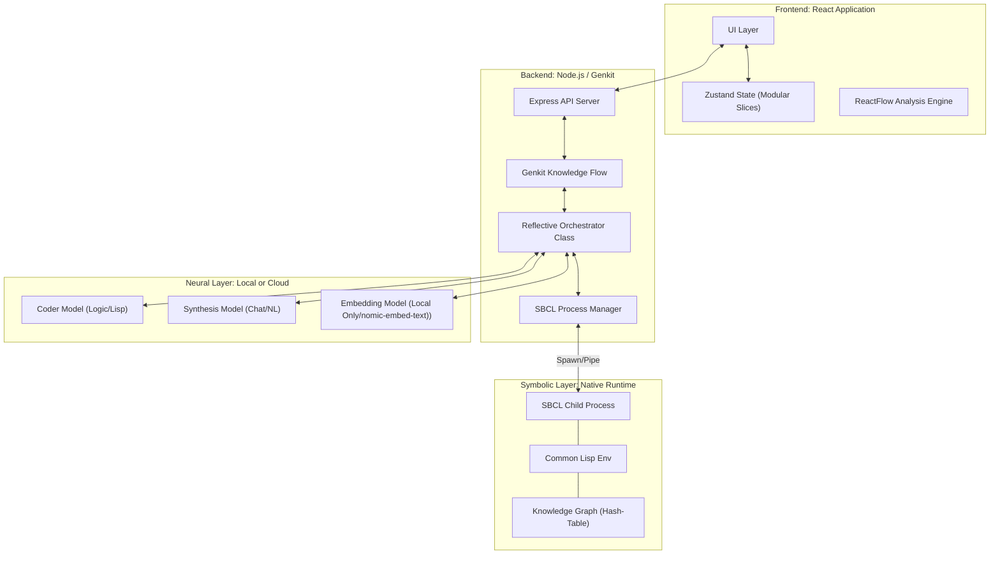
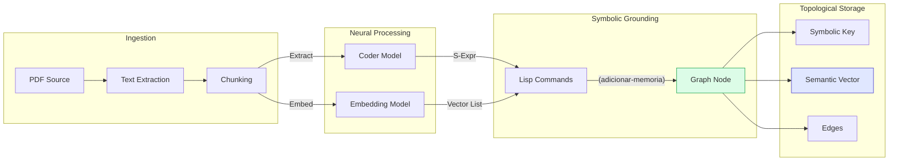
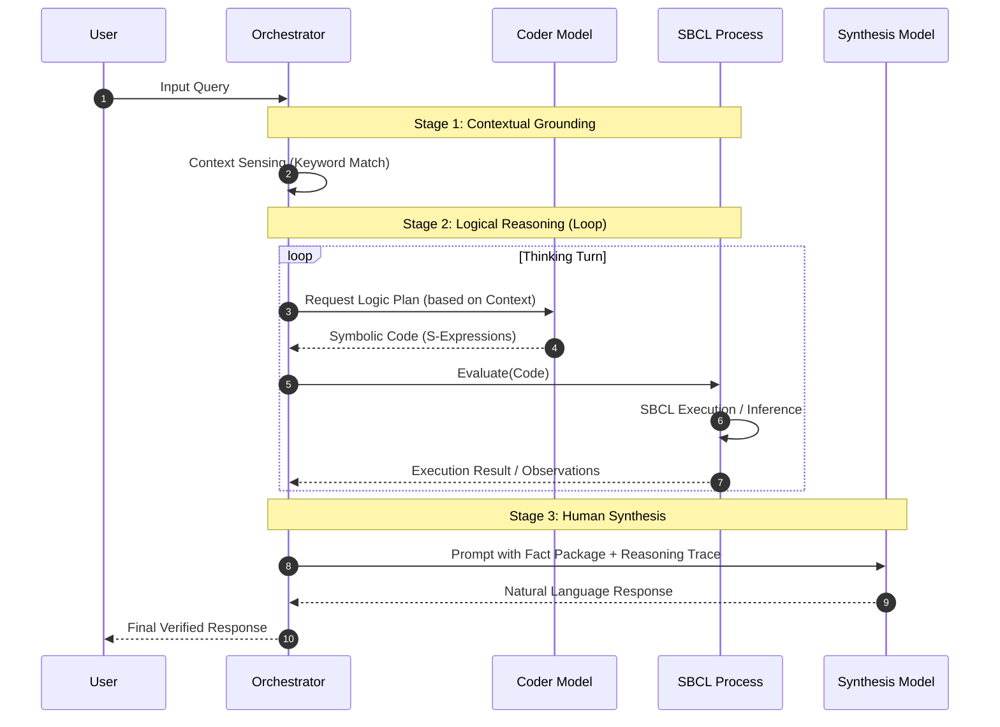
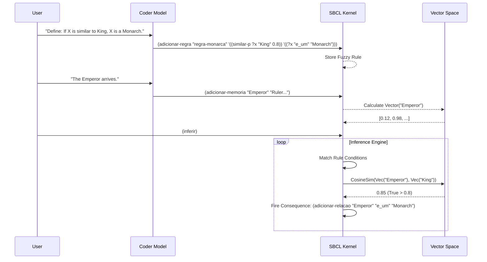
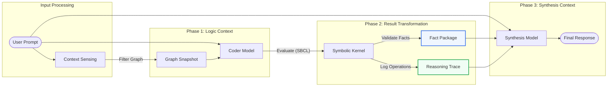

# SDialectic: Neuro-Symbolic Cognitive Architecture

> **Status**: Incipient Personal Research Project. This repository hosts experimental code for researching in Neurosymbolic AI.

SDialectic is an neuro-symbolic experimentintended to be an high-precision knowledge extraction and logical reasoning. It implements a **Dual-Process** architecture that bridges the creative flexibility of Large Language Models (LLMs) with the formal rigor of a **Native Symbolic Logic Kernel** (SBCL).

## 1. Executive Summary: The Dual-Process Theory

The system is built upon the Dual-Process theory of cognition, distinguishing between two primary modes of processing:

1.  **System 1 (Neural Intuition)**: Handled by the **Synthesis Model** (e.g., Local Gemma 3 or Cloud Gemini 2.5). This layer manages natural language understanding, context sensing, and creative synthesis.
2.  **System 2 (Symbolic Logic)**: Driven by the **SBCL Kernel** (Steel Bank Common Lisp) and the **Coder Model** (e.g. Local Qwen 2.5 or Cloud Gemini 2.5). This layer provides an immutable, high-performance environment for formal logic, atomic fact storage, and deterministic inference.

The interaction between these layers is managed by the **Reflective Orchestrator**, ensuring that every neural intuition is grounded in symbolic truth.

---

## 2. System Architecture

The architecture is composed of three primary layers: the User Interface, the Orchestration Layer, and the Native Symbolic Kernel.

### 2.1 Concept: The Digital Brain (Didactic View)



### 2.2 Component Topology (High-Level)



### 2.3 Technical Topology (Detailed)



---

## 3. Data Flow: From Text to Topological Knowledge

The ingestion pipeline transforms unstructured text into structured, vector-grounded symbolic knowledge.



---

## 4. Core Component: The Reflective Loop

The Reflective Loop is a multi-turn cognitive process where the AI "reasons" by writing and executing symbolic code before presenting a result.

### 4.1 Interaction Sequence



### 4.2 Neuro-Symbolic Inference (Fuzzy Logic Cycle)

SDialectic extends classical logic with fuzzy predicates (`similar-p`) that leverage vector similarity to bridge semantic gaps.



---

## 5. Cognitive Specialization and Context Engineering

The system optimizes for accuracy by treating the Logic Model and the Synthesis Model as two specialized agents with distinct context windows.

### 5.1 Model Roles and Context Inputs

| Feature | Coder Model (e.g., Qwen/Gemini) | Synthesis Model (e.g., Gemma/Gemini) | Embedding Model/nomic-embed-text |
| :--- | :--- | :--- | :--- |
| **Primary Goal** | Translate natural language into formal logic. | Translate formal facts into natural language. | Create semantic vectors. |
| **Primary Context** | User Prompt + Current Graph Snapshot. | User Prompt + Fact Package + Reasoning Trace. | Raw Text Chunks. |
| **Output Type** | Executable Lisp (S-Expressions). | Formatted Markdown / Natural Language. | Float32 Vector Arrays. |
| **Hosting** | Local or Cloud. | Local or Cloud. | **Local Only.** |

### 5.2 The Context Transformation Pipeline



### 5.3 SBCL Process Integration

Unlike browser-based Lisp implementations, SDialectic uses a robust **Child Process** architecture:

1.  **Spawn**: The backend spawns a dedicated `sbcl` instance (`--noinform --disable-debugger`).
2.  **Bootstrap**: On startup, it loads `lisp/bootstrap.lisp` into the `:s-dialectic` package.
3.  **Sanitization**: Output from the REPL is rigorously sanitized to remove prompts (`*`), debugger info, and artifacts, ensuring clean JSON or atomic results.
4.  **Resilience**: If the Lisp process crashes or enters a debugger loop, the `SBCLProcess` manager detects the stderr pattern, aborts components, or restarts the process automatically.

---

## 6. Key Features

### 6.1 Advanced Graph Analysis
The system includes a sophisticated visualization suite for interacting with the Knowledge Graph in real-time.
- **Dynamic Filtering**: Toggle visibility of Entities and Relations independently.
- **Hybrid State**: Merges React-side "Memories" with Lisp-side "Knowledge Graph" for a unified view.
- **Flexible Layout**: Switch between Vertical (Top-Bottom) and Horizontal (Left-Right) views via ReactFlow.
- **Topological Knowledge Graph**: Nodes contain both explicit textual descriptions and high-dimensional vector representations.

### 6.2 Symbolic Live Stream (Live REPL)
Every logical operation performed by the AI is streamed to the UI in real-time via Server-Sent Events (SSE).
- Lisp commands being generated.
- Internal graph mutations.
- Reasoning traces (`(infer)`, `(add-node)`).

### 6.3 Neuro-Symbolic Inference (New)
- **Fuzzy Rules**: Logic rules can include `(similar-p ?var "concept" threshold)` conditions, allowing logic to operate on semantic proximity.

### 6.4 Resilience and Data Integrity
- **Rollback Mechanism**: Middleware registers connection status; if a client aborts, the graph state rolls back to the last consistent checkpoint.
- **File Cleanup**: Automated cleanup of uploaded PDFs and temporary files after extraction or failure.
- **Strict Environment**: Uses `dotenv` with strict mode validation to ensure all model configurations are present before boot.

### 6.5 Logic & Set Theory Engine (V2.1)
The Symbolic Kernel has been upgraded to support pure logical reasoning and set theory, enabling:
- **Set Operations**: Intersection, Union, Difference on both explicit sets and implicit sets defined by criteria.
- **Criteria Engine**: The `satisfy-criteria-p` function allows the system to evaluate complex conditions against the graph (e.g., "All Entities BORN_IN Germany").
- **Solver Mode**: The system can solve mathematical and logical queries (e.g., "Who is in the intersection of X and Y?") by executing Lisp primitives.
- **Axiomatic Checks**: Prevents logical contradictions (e.g., checking `1 + 1 = 2`) before ingesting facts.

### 6.6 Dynamic Domain Switching
The architecture now supports hot-swapping "Cognitive Domains" via configuration (`DOMAIN_SPECIFIC_KNOWLEDGE`):
- **Biomedical Mode**: Specialized in causal pathways, mechanism of action, and systems biology.
- **Logic Analyst Mode**: Specialized in set definitions, axioms, and propositional logic.
This allows S-Dialectic to adapt its "personality" and prompt engineering strategy without code changes, just by pointing to a different prompt directory.


---

## 7. Technical Stack

-   **Orchestration**: Node.js, Genkit, TypeScript.
-   **Orchestration**: Node.js, Genkit, TypeScript.
-   **Cognitive Layer**: 
    - **Coder Model**: Local (Qwen 2.5) or Cloud (Gemini 2.5).
    - **Synthesis Model**: Local (Gemma 3) or Cloud (Gemini 2.5).
    - **Embedding Model**: Local Only (nomic-embed-text / mxbai).
-   **Symbolic Layer**: **SBCL (Steel Bank Common Lisp)** via Node.js Child Process.
-   **Frontend**: React 19, ReactFlow, Zustand, TailwindCSS, Radix UI.
-   **State Management**: Unified `useDialecticStore` combining Config, Chat, Source, and Graph slices.

---

## 8. Inspiration & Acknowledgments

This project was originally inspired by the research on persistent Lisp metaprogramming loops:

> **From Tool Calling to Symbolic Thinking: LLMs in a Persistent Lisp Metaprogramming Loop**  
> *Jordi de la Torre*  
> arXiv:2506.10021 [cs.PL]  
> https://doi.org/10.48550/arXiv.2506.10021  

```bibtex
@article{delatorre2025symbolic,
  title={From Tool Calling to Symbolic Thinking: LLMs in a Persistent Lisp Metaprogramming Loop},
  author={De La Torre, Jordi},
  journal={arXiv preprint arXiv:2506.10021},
  year={2025},
  url={https://arxiv.org/abs/2506.10021}
}
```

---

## License: Dual Licensing

This project is licensed under a **Dual License** model:

1.  **Personal & Non-Commercial Use**: Licensed under the **MIT License**. You are free to use, modify, and distribute this software for personal queries, research, or open-source projects.
2.  **Commercial Use**: When production ready, this project is intended for commercial use besides research. For any commercial application, proprietary software integration, or deployed services generating revenue, a separate **Commercial License** is required.

Please contact the author for commercial licensing inquiries
